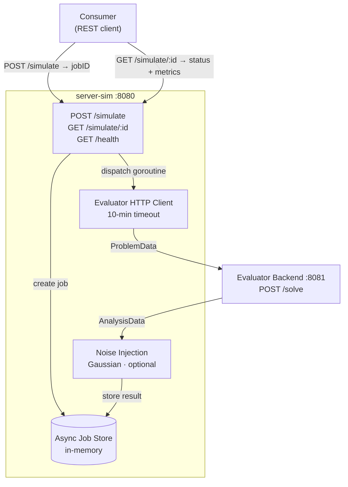
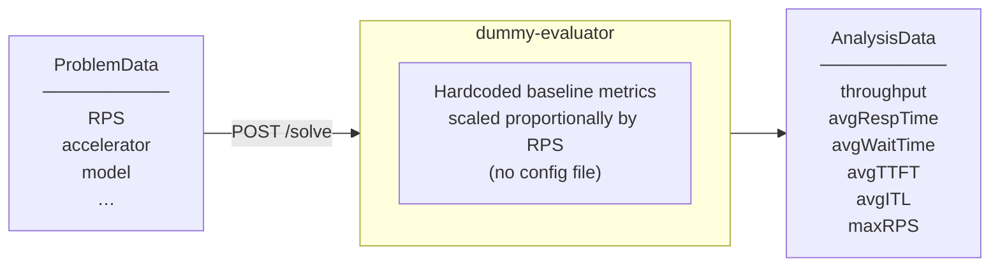
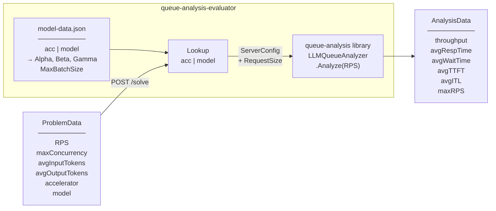
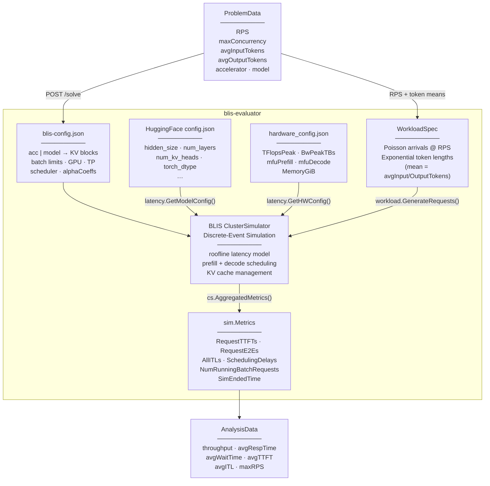

# server-sim

LLM server performance simulator. Given workload characteristics, produces performance metrics (TTFT, ITL, goodput) by delegating to a pluggable evaluator backend.

See [docs/design.md](docs/design.md) for architecture and API reference.

## Architecture



Three evaluator backends are available, each implementing the same `POST /solve` interface:

| Phase | Evaluator | Approach |
|-------|-----------|----------|
| 1 | [Dummy](#phase-1-skeleton--dummy-evaluator) | Hardcoded metrics scaled by RPS |
| 2 | [Queue-Analysis](#phase-2-queue-analysis-evaluator) | Analytical M/G/1 queue model |
| 3 | [BLIS](#phase-3-blis-discrete-event-simulator-evaluator) | Discrete-event simulation |

## Evaluator Interface

All backends share the same REST contract:

```mermaid
flowchart LR
    subgraph req["POST /solve  —  ProblemData"]
        direction TB
        r1["RPS · float32"]
        r2["maxConcurrency · int"]
        r3["avgInputTokens · float32"]
        r4["avgOutputTokens · float32"]
        r5["accelerator · string"]
        r6["model · string"]
    end

    subgraph resp["200 OK  —  AnalysisData"]
        direction TB
        a1["throughput · float32  (req/s)"]
        a2["avgRespTime · float32  (ms)"]
        a3["avgWaitTime · float32  (ms)"]
        a5["avgTTFT · float32  (ms)"]
        a6["avgITL · float32  (ms)"]
        a7["maxRPS · float32  (req/s)"]
    end

    req -->|"evaluator-specific\nparameters resolved\nfrom config file"| resp
```



Evaluator-specific parameters (latency coefficients, KV cache size, etc.) are never exposed in the request — each backend resolves them internally from its own config file keyed by `accelerator + model`.

---

## Phase 1: Skeleton + Dummy Evaluator



### Prerequisites

- Go 1.24+

### Build

```bash
go build ./...
```

### Test Run

**Step 1 — start the dummy evaluator** (terminal 1):

```bash
go run ./dummy-evaluator
# Listening on :8081
```

**Step 2 — start server-sim** (terminal 2):

```bash
EVALUATOR_URL=http://localhost:8081 go run ./cmd/server-sim
# Listening on :8080
```

**Step 3 — exercise the API** (terminal 3):

```bash
# Health check
curl http://localhost:8080/health

# Submit a simulation job
curl -s -X POST http://localhost:8080/simulate \
  -H "Content-Type: application/json" \
  -d '{
    "RPS": 3.0,
    "maxConcurrency": 48,
    "avgInputTokens": 128,
    "avgOutputTokens": 512,
    "accelerator": "H100",
    "model": "llama-3-8b"
  }'
# → {"jobID":"<uuid>"}

# Poll for result (replace <uuid>)
curl -s http://localhost:8080/simulate/<uuid>
# → {"jobID":"...","status":"completed","result":{...}}
```

### Test Noise Injection

Restart server-sim with `NOISE_ENABLED=true` and repeat the submit/poll steps a few times — metrics will vary slightly each call:

```bash
EVALUATOR_URL=http://localhost:8081 NOISE_ENABLED=true go run ./cmd/server-sim
```

### Configuration

| Variable | Default | Description |
|----------|---------|-------------|
| `SERVERSIM_PORT` | `8080` | server-sim listen port |
| `EVALUATOR_URL` | `http://localhost:8081` | Evaluator backend base URL |
| `NOISE_ENABLED` | `false` | Add Gaussian noise to metrics |
| `NOISE_STD_FRACTION` | `0.05` | Noise std dev as fraction of metric value |
| `JOB_TTL_MINUTES` | `60` | Minutes to retain completed/failed jobs before eviction |

### Docker

```bash
docker build -t server-sim .
docker run -p 8080:8080 -e EVALUATOR_URL=http://<evaluator-host>:8081 server-sim
```

---

## Phase 2: Queue-Analysis Evaluator

Uses the [queue-analysis](https://github.com/llm-inferno/queue-analysis) analytical model. A JSON config file maps `accelerator + model` pairs to model parameters (Alpha, Beta, Gamma). MaxQueueSize is applied uniformly across all models via the `DEFAULT_MAX_QUEUE_SIZE` environment variable.



### Test Run

**Step 1 — start the queue-analysis evaluator** (terminal 1):

```bash
MODEL_DATA_FILE=/path/to/model-data.json go run ./queue-analysis-evaluator
# Listening on :8081
```

The `model-data.json` file maps accelerator+model pairs to Alpha/Beta/Gamma parameters. See [sample-data](https://github.com/llm-inferno/sample-data) for examples.

**Step 2 — start server-sim** (terminal 2):

```bash
EVALUATOR_URL=http://localhost:8081 go run ./cmd/server-sim
```

**Step 3 — submit and poll** (terminal 3):

```bash
# Submit job (use names matching entries in your model-data.json)
curl -s -X POST http://localhost:8080/simulate \
  -H "Content-Type: application/json" \
  -d '{"RPS":1.0,"avgInputTokens":128,"avgOutputTokens":512,"accelerator":"A100","model":"llama_13b"}'
# → {"jobID":"<uuid>"}

# Poll for result
curl -s http://localhost:8080/simulate/<uuid>
# → {"jobID":"<uuid>","status":"completed","result":{"avgTTFT":120.0,"avgITL":54.9,"maxRPS":1.31,...}}
```

Note: if RPS exceeds the model's maximum stable rate (`maxRPS`), the job will show `"status":"failed"`.

**Unknown accelerator/model** — the job will show `"status":"failed"`:

```bash
curl -s -X POST http://localhost:8080/simulate \
  -H "Content-Type: application/json" \
  -d '{"RPS":1.0,"avgInputTokens":128,"avgOutputTokens":512,"accelerator":"H100","model":"gpt-4"}'
```

### Configuration

| Variable | Default | Description |
|----------|---------|-------------|
| `MODEL_DATA_FILE` | `model-data.json` | Path to model-data.json |
| `DEFAULT_MAX_QUEUE_SIZE` | `128` | Default max queue size for all models |
| `EVALUATOR_PORT` | `8081` | Queue-analysis evaluator listen port |

---

## Phase 3: BLIS Discrete-Event Simulator Evaluator

Uses [inference-sim/BLIS](https://github.com/inference-sim/inference-sim) as a discrete-event simulator backend. A JSON config file maps `accelerator + model` pairs to simulation parameters (KV cache, batch limits, hardware specs, HuggingFace model config).



### Prerequisites

- HuggingFace `config.json` for each model (see [Obtaining HuggingFace model configs](#obtaining-huggingface-model-configs))
- `hardware_config.json` from the inference-sim repo (or your own copy)

### Test Run

**Step 1 — start the BLIS evaluator** (terminal 1):

```bash
cd blis-evaluator
BLIS_CONFIG_FILE=blis-config.json \
  HW_CONFIG_FILE=/path/to/inference-sim/hardware_config.json \
  go run .
# Listening on :8081
```

The `blis-config.json` maps accelerator+model pairs to BLIS simulation parameters. A sample config with 10 entries is included (H100 and A100 for `ibm-granite/granite-3.1-8b-instruct`, `ibm-granite/granite-34b-code-instruct-8k`, `meta-llama/Llama-2-13b-hf`, `meta-llama/Llama-2-70b-hf`, and `mistralai/Mixtral-8x7B-v0.1`). The corresponding HuggingFace `config.json` files are included in `hf-configs/`.

**Step 2 — start server-sim** (terminal 2):

```bash
EVALUATOR_URL=http://localhost:8081 go run ./cmd/server-sim
```

**Step 3 — submit and poll** (terminal 3):

```bash
# Submit job (accelerator and model must match entries in blis-config.json)
curl -s -X POST http://localhost:8080/simulate \
  -H "Content-Type: application/json" \
  -d '{
    "RPS": 5.0,
    "maxConcurrency": 0,
    "avgInputTokens": 512,
    "avgOutputTokens": 128,
    "accelerator": "H100",
    "model": "ibm-granite/granite-3.1-8b-instruct"
  }'
# → {"jobID":"<uuid>"}

# Poll for result — DES runs take seconds; keep polling until status is completed
curl -s http://localhost:8080/simulate/<uuid>
# → {"status":"completed","result":{"throughput":5.0,"avgTTFT":45.2,"avgITL":12.1,...}}
```

> **Note:** DES simulations run for a configurable horizon (default 300 seconds of simulated time). The job will show `"status":"pending"` while the simulation is running. server-sim's HTTP client has a 10-minute wall-clock timeout.

### Configuration

| Variable | Default | Description |
|----------|---------|-------------|
| `BLIS_CONFIG_FILE` | `blis-config.json` | Path to blis-config.json |
| `HW_CONFIG_FILE` | `hardware_config.json` | Path to inference-sim hardware_config.json |
| `LATENCY_BACKEND` | `roofline` | Latency model: `roofline`, `blackbox`, `crossmodel`, `trained-roofline`, `trained-physics` |
| `EVALUATOR_PORT` | `8081` | BLIS evaluator listen port |

### blis-config.json schema

Each entry in the `models` array configures one `accelerator + model` pair:

| Field | Required | Description |
|-------|----------|-------------|
| `accelerator` | ✓ | Accelerator name (matched against request) |
| `model` | ✓ | Model name (matched against request) |
| `hfConfigPath` | ✓ | Path to HuggingFace `config.json` for the model |
| `gpu` | ✓ | GPU name matching `hardware_config.json` (e.g. `"H100"`, `"A100-80"`) |
| `totalKVBlocks` | ✓ | Total GPU KV cache blocks |
| `maxRunningReqs` | ✓ | Max concurrent requests in running batch |
| `maxScheduledTokens` | ✓ | Max total new tokens across running batch |
| `hwConfigPath` | | Per-entry hardware config path (overrides `HW_CONFIG_FILE`) |
| `tp` | | Tensor parallelism degree (default: `1`) |
| `blockSizeTokens` | | Tokens per KV block (default: `16`) |
| `maxModelLen` | | Max sequence length, input+output (default: `0` = unlimited) |
| `scheduler` | | Scheduling policy: `fcfs`, `sjf`, `priority-fcfs` (default: `fcfs`) |
| `betaCoeffs` | | Step-time regression coefficients required by non-roofline backends: ≥3 for `blackbox`, ≥4 for `crossmodel`, ≥7 for `trained-roofline` or `trained-physics`; unused by `roofline` (default: `[]`) |
| `alphaCoeffs` | | Queueing time coefficients `[α₀, α₁, α₂]` in µs — calibrated values from inference-sim's `defaults.yaml` give accurate TTFT; defaults to `[0, 0, 0]` |
| `simulationHorizon` | | Simulated time window in microseconds (default: `300000000` = 300s). Longer horizons reduce cold-start bias in throughput: the DES starts with an empty system, so a short horizon inflates the ramp-up fraction. Per-entry override is the escape valve if a specific model/RPS combination takes too long to simulate. |
| `numRequests` | | Max requests to simulate, `0` = use horizon only (default: `0`) |
| `seed` | | RNG seed for deterministic results (default: `42`) |

### Obtaining HuggingFace model configs

HuggingFace `config.json` files for the bundled models are already checked in under `blis-evaluator/hf-configs/`. To add a new model, place its `config.json` in `blis-evaluator/hf-configs/<org>/<model-name>/` and add a corresponding entry to `blis-config.json`.

For public models (no auth required):

```bash
mkdir -p blis-evaluator/hf-configs/<org>/<model-name>
curl -L "https://huggingface.co/<org>/<model-name>/resolve/main/config.json" \
  -o blis-evaluator/hf-configs/<org>/<model-name>/config.json
```

For gated models (e.g. Llama):

```bash
pip install huggingface_hub
huggingface-cli login
huggingface-cli download <org>/<model-name> config.json \
  --local-dir blis-evaluator/hf-configs/<org>/<model-name>
```
