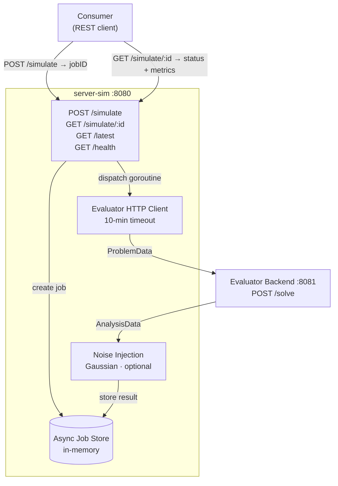
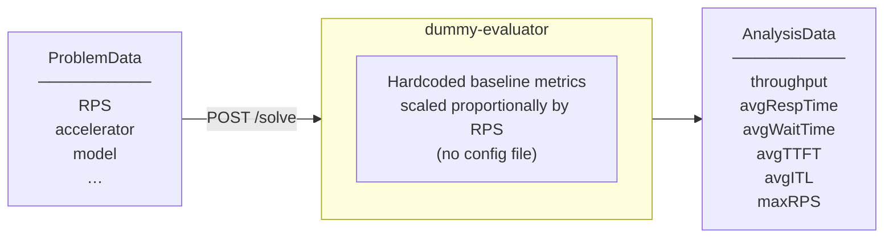
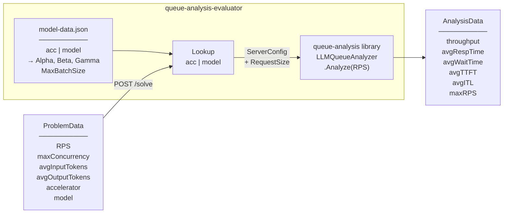
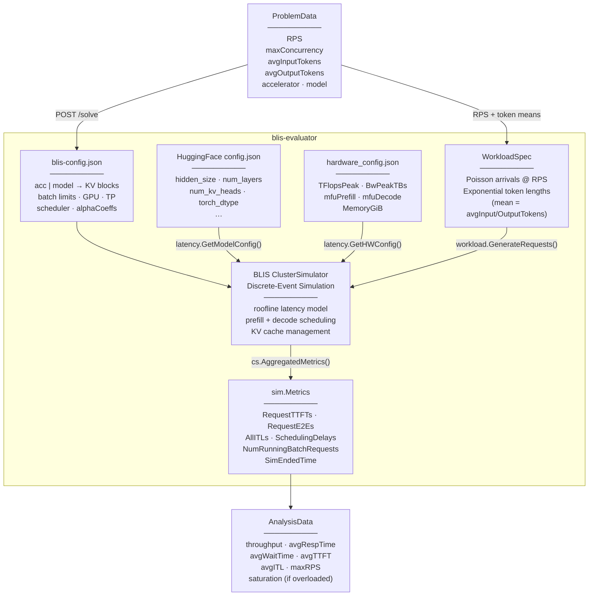
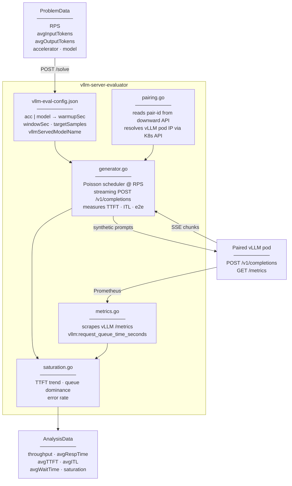

# server-sim

LLM server performance simulator. Given workload characteristics, produces performance metrics (TTFT, ITL, goodput) by delegating to a pluggable evaluator backend.

See [docs/design.md](docs/design.md) for architecture and API reference.

## Architecture


```mermaid
flowchart TD
    Consumer["Consumer\n(REST client)"]

    subgraph ss["server-sim  :8080"]
        API["POST /simulate\nGET  /simulate/:id\nGET  /latest\nGET  /health"]
        Jobs[("Async Job Store\nin-memory")]
        Noise["Noise Injection\nGaussian · optional"]
        EvalClient["Evaluator HTTP Client\n10-min timeout"]
    end

    Evaluator["Evaluator Backend  :8081\nPOST /solve"]

    Consumer -->|"POST /simulate → jobID"| API
    Consumer -->|"GET /simulate/:id → status + metrics"| API
    API -->|create job| Jobs
    API -->|dispatch goroutine| EvalClient
    EvalClient -->|ProblemData| Evaluator
    Evaluator -->|AnalysisData| Noise
    Noise -->|store result| Jobs
```

Four evaluator backends are available, each implementing the same `POST /solve` interface:

| Phase | Evaluator | Approach |
|-------|-----------|----------|
| 1 | [Dummy](#phase-1-skeleton--dummy-evaluator) | Hardcoded metrics scaled by RPS |
| 2 | [Queue-Analysis](#phase-2-queue-analysis-evaluator) | Analytical state-dependent Markovian queue model |
| 3 | [BLIS](#phase-3-blis-discrete-event-simulator-evaluator) | Discrete-event simulation |
| 4 | [vllm-server](docs/vllm-server-evaluator.md) | Drives a real paired vLLM server (open-loop Poisson) |

## Evaluator Interface

All backends share the same REST contract: `POST /solve` accepts a `ProblemData` body (`RPS`, `maxConcurrency`, `avgInputTokens`, `avgOutputTokens`, `accelerator`, `model`) and returns `AnalysisData` (`throughput`, `avgRespTime`, `avgWaitTime`, `avgTTFT`, `avgITL`, `maxRPS`, `saturation`).

Evaluator-specific parameters (latency coefficients, KV cache size, etc.) are never exposed in the request — each backend resolves them internally from its own config file keyed by `accelerator + model`.

The `saturation` field is set when the offered load exceeds server capacity. Values: `"bandwidth"` (decode memory bandwidth bottleneck), `"kv_capacity"` (KV cache exhausted), `"overloaded"` (generic, e.g. queue-analysis). When `saturation` is present, latency metrics may be unreliable or zero; `maxRPS` is still populated where computable. Noise is never applied to saturated results. See [docs/saturation-detection.md](docs/saturation-detection.md) for details.

---

## Phase 1: Skeleton + Dummy Evaluator


```mermaid
flowchart LR
    PD["ProblemData\n──────────\nRPS\naccelerator\nmodel\n…"]

    subgraph dummy["dummy-evaluator"]
        Logic["Hardcoded baseline metrics\nscaled proportionally by RPS\n(no config file)"]
    end

    PD -->|POST /solve| dummy
    dummy --> AD["AnalysisData\n──────────\nthroughput\navgRespTime\navgWaitTime\navgTTFT\navgITL\nmaxRPS"]
```

### Prerequisites

- Go 1.24+

### Build

```bash
go build ./...
```

### Test Run

**Step 1 — start the dummy evaluator** (terminal 1):

```bash
go run ./dummy-evaluator
# Listening on :8081
```

**Step 2 — start server-sim** (terminal 2):

```bash
EVALUATOR_URL=http://localhost:8081 go run ./cmd/server-sim
# Listening on :8080
```

**Step 3 — exercise the API** (terminal 3):

```bash
# Health check
curl http://localhost:8080/health

# Submit a simulation job
curl -s -X POST http://localhost:8080/simulate \
  -H "Content-Type: application/json" \
  -d '{
    "RPS": 3.0,
    "maxConcurrency": 48,
    "avgInputTokens": 128,
    "avgOutputTokens": 512,
    "accelerator": "H100",
    "model": "llama-3-8b"
  }'
# → {"jobID":"<uuid>"}

# Poll for result (replace <uuid>)
curl -s http://localhost:8080/simulate/<uuid>
# → {"jobID":"...","status":"completed","result":{...}}
```

### Test Noise Injection

Restart server-sim with `NOISE_ENABLED=true` and repeat the submit/poll steps a few times — metrics will vary slightly each call:

```bash
EVALUATOR_URL=http://localhost:8081 NOISE_ENABLED=true go run ./cmd/server-sim
```

### Configuration

| Variable | Default | Description |
|----------|---------|-------------|
| `SERVERSIM_PORT` | `8080` | server-sim listen port |
| `EVALUATOR_URL` | `http://localhost:8081` | Evaluator backend base URL |
| `NOISE_ENABLED` | `false` | Add Gaussian noise to metrics |
| `NOISE_STD_FRACTION` | `0.05` | Noise std dev as fraction of metric value |
| `JOB_TTL_MINUTES` | `60` | Minutes to retain completed/failed jobs before eviction |
| `SERVERSIM_CONTINUOUS` | `false` | Enable continuous evaluation loop (reads workload from labels file each tick) |
| `SERVERSIM_TICK_SECONDS` | `5` | Continuous loop tick interval in seconds (floor: 1) |
| `SERVERSIM_SATURATION_POLICY` | `retry-at-lower-load` | Saturation handling: `retry-at-lower-load` or `pass-through` (unknown values fall back to the default) |
| `SERVERSIM_LABELS_DIR` | `/etc/podinfo` | Directory containing the downward-API `labels` file used by the continuous loop |

### Continuous mode

When `SERVERSIM_CONTINUOUS=true`, server-sim starts a background loop that runs evaluation windows back-to-back. Each tick it reads the current workload (`rpm`, `intokens`, `outtokens`, `model`, `accelerator`, `maxbatchsize`) from the downward-API labels file at `<SERVERSIM_LABELS_DIR>/labels` and runs one window with the configured saturation policy. The result is stored and served by `GET /latest`. When the `maxbatchsize` label changes between ticks, the in-flight window is cancelled so the next window immediately reflects the new allocation. `POST /simulate` continues to work alongside the loop.

```bash
# Read the most-recent completed window result
curl -s http://localhost:8080/latest
# → {"completedAt":"2026-01-02T15:04:05Z","effectiveInput":{...},"result":{...}}

# Cold start (no window has completed yet)
curl -s http://localhost:8080/latest
# → 404 {"error":"no result yet"}
```

### Docker

```bash
docker build -t server-sim .
docker run -p 8080:8080 -e EVALUATOR_URL=http://<evaluator-host>:8081 server-sim
```

---

## Phase 2: Queue-Analysis Evaluator

Uses the [queue-analysis](https://github.com/llm-inferno/queue-analysis) analytical model. A JSON config file maps `accelerator + model` pairs to model parameters (Alpha, Beta, Gamma). MaxQueueSize is applied uniformly across all models via the `DEFAULT_MAX_QUEUE_SIZE` environment variable.


```mermaid
flowchart LR
    PD["ProblemData\n──────────\nRPS\nmaxConcurrency\navgInputTokens\navgOutputTokens\naccelerator\nmodel"]

    subgraph qa["queue-analysis-evaluator"]
        Config["model-data.json\n──────────\nacc | model\n→ Alpha, Beta, Gamma\n   MaxBatchSize"]
        Lookup["Lookup\nacc | model"]
        Lib["queue-analysis library\nLLMQueueAnalyzer\n.Analyze(RPS)"]
        Config --> Lookup
    end

    PD -->|POST /solve| Lookup
    Lookup -->|"ServerConfig\n+ RequestSize"| Lib
    Lib --> AD["AnalysisData\n──────────\nthroughput\navgRespTime\navgWaitTime\navgTTFT\navgITL\nmaxRPS"]
```

### Test Run

**Step 1 — start the queue-analysis evaluator** (terminal 1):

```bash
MODEL_DATA_FILE=/path/to/model-data.json go run ./queue-analysis-evaluator
# Listening on :8081
```

The `model-data.json` file maps accelerator+model pairs to Alpha/Beta/Gamma parameters. See [sample-data](https://github.com/llm-inferno/sample-data) for examples.

**Step 2 — start server-sim** (terminal 2):

```bash
EVALUATOR_URL=http://localhost:8081 go run ./cmd/server-sim
```

**Step 3 — submit and poll** (terminal 3):

```bash
# Submit job (use names matching entries in your model-data.json)
curl -s -X POST http://localhost:8080/simulate \
  -H "Content-Type: application/json" \
  -d '{"RPS":1.0,"avgInputTokens":128,"avgOutputTokens":512,"accelerator":"A100","model":"llama_13b"}'
# → {"jobID":"<uuid>"}

# Poll for result
curl -s http://localhost:8080/simulate/<uuid>
# → {"jobID":"<uuid>","status":"completed","result":{"avgTTFT":120.0,"avgITL":54.9,"maxRPS":1.31,...}}
```

Note: if RPS exceeds the model's maximum stable rate (`maxRPS`), the job completes with `"saturation":"overloaded"` rather than failing. Metrics reflect degraded-state behaviour; `maxRPS` indicates the capacity limit.

**Unknown accelerator/model** — the job will show `"status":"failed"`:

```bash
curl -s -X POST http://localhost:8080/simulate \
  -H "Content-Type: application/json" \
  -d '{"RPS":1.0,"avgInputTokens":128,"avgOutputTokens":512,"accelerator":"H100","model":"gpt-4"}'
```

### Configuration

| Variable | Default | Description |
|----------|---------|-------------|
| `MODEL_DATA_FILE` | `model-data.json` | Path to model-data.json |
| `DEFAULT_MAX_QUEUE_SIZE` | `0` | Default max queue size for all models (0 = no external queue) |
| `EVALUATOR_PORT` | `8081` | Queue-analysis evaluator listen port |

---

## Phase 3: BLIS Discrete-Event Simulator Evaluator

Uses [inference-sim/BLIS](https://github.com/inference-sim/inference-sim) as a discrete-event simulator backend. A JSON config file maps `accelerator + model` pairs to simulation parameters (KV cache, batch limits, hardware specs, HuggingFace model config).


```mermaid
flowchart TB
    PD["ProblemData\n──────────\nRPS\nmaxConcurrency\navgInputTokens\navgOutputTokens\naccelerator · model"]

    subgraph blis["blis-evaluator"]
        direction TB
        Config["blis-config.json\n──────────\nacc | model → KV blocks\n  batch limits · GPU · TP\n  scheduler · alphaCoeffs"]
        HF["HuggingFace config.json\n──────────\nhidden_size · num_layers\nnum_kv_heads · torch_dtype\n…"]
        HW["hardware_config.json\n──────────\nTFlopsPeak · BwPeakTBs\nmfuPrefill · mfuDecode\nMemoryGiB"]
        Workload["WorkloadSpec\n──────────\nPoisson arrivals @ RPS\nExponential token lengths\n(mean = avgInput/OutputTokens)"]
        Sim["BLIS ClusterSimulator\nDiscrete-Event Simulation\n──────────\nroofline latency model\nprefill + decode scheduling\nKV cache management"]
        Metrics["sim.Metrics\n──────────\nRequestTTFTs · RequestE2Es\nAllITLs · SchedulingDelays\nNumRunningBatchRequests\nSimEndedTime"]

        Config --> Sim
        HF -->|"latency.GetModelConfig()"| Sim
        HW -->|"latency.GetHWConfig()"| Sim
        Workload -->|"workload.GenerateRequests()"| Sim
        Sim -->|"cs.AggregatedMetrics()"| Metrics
    end

    PD -->|POST /solve| Config
    PD -->|RPS + token means| Workload
    Metrics --> AD["AnalysisData\n──────────\nthroughput · avgRespTime\navgWaitTime · avgTTFT\navgITL · maxRPS\nsaturation (if overloaded)"]
```

### Prerequisites

- HuggingFace `config.json` for each model (see [Obtaining HuggingFace model configs](#obtaining-huggingface-model-configs))
- `hardware_config.json` from the inference-sim repo (or your own copy)

### Test Run

**Step 1 — start the BLIS evaluator** (terminal 1):

```bash
cd blis-evaluator
BLIS_CONFIG_FILE=blis-config.json \
  HW_CONFIG_FILE=/path/to/inference-sim/hardware_config.json \
  go run .
# Listening on :8081
```

The `blis-config.json` maps accelerator+model pairs to BLIS simulation parameters. A sample config with 10 entries is included (H100 and A100 for `ibm-granite/granite-3.1-8b-instruct`, `ibm-granite/granite-34b-code-instruct-8k`, `meta-llama/Llama-2-13b-hf`, `meta-llama/Llama-2-70b-hf`, and `mistralai/Mixtral-8x7B-v0.1`). The corresponding HuggingFace `config.json` files are included in `hf-configs/`.

**Step 2 — start server-sim** (terminal 2):

```bash
EVALUATOR_URL=http://localhost:8081 go run ./cmd/server-sim
```

**Step 3 — submit and poll** (terminal 3):

```bash
# Submit job (accelerator and model must match entries in blis-config.json)
curl -s -X POST http://localhost:8080/simulate \
  -H "Content-Type: application/json" \
  -d '{
    "RPS": 5.0,
    "maxConcurrency": 0,
    "avgInputTokens": 512,
    "avgOutputTokens": 128,
    "accelerator": "H100",
    "model": "ibm-granite/granite-3.1-8b-instruct"
  }'
# → {"jobID":"<uuid>"}

# Poll for result — DES runs take seconds; keep polling until status is completed
curl -s http://localhost:8080/simulate/<uuid>
# → {"status":"completed","result":{"throughput":5.0,"avgTTFT":45.2,"avgITL":12.1,...}}
```

> **Note:** DES simulations run for a configurable horizon (default 300 seconds of simulated time). The job will show `"status":"pending"` while the simulation is running. server-sim's HTTP client has a 10-minute wall-clock timeout.
>
> **Saturation check:** Before running the DES, the BLIS evaluator performs an analytical check using decode memory bandwidth and KV cache capacity bounds. If the workload is analytically overloaded, the job completes immediately (DES is skipped) with `"saturation":"bandwidth"` or `"saturation":"kv_capacity"` and `maxRPS` set to the derived capacity limit. If the DES runs but produces overload indicators (`StillQueued > 0`, etc.), the result is flagged `"saturation":"overloaded"`. This check is independent of `LATENCY_BACKEND`.

### Configuration

| Variable | Default | Description |
|----------|---------|-------------|
| `BLIS_CONFIG_FILE` | `blis-config.json` | Path to blis-config.json |
| `HW_CONFIG_FILE` | `hardware_config.json` | Path to inference-sim hardware_config.json |
| `LATENCY_BACKEND` | `roofline` | Latency model: `roofline`, `blackbox`, `crossmodel`, `trained-roofline`, `trained-physics` |
| `EVALUATOR_PORT` | `8081` | BLIS evaluator listen port |

### blis-config.json schema

Each entry in the `models` array configures one `accelerator + model` pair:

| Field | Required | Description |
|-------|----------|-------------|
| `accelerator` | ✓ | Accelerator name (matched against request) |
| `model` | ✓ | Model name (matched against request) |
| `hfConfigPath` | ✓ | Path to HuggingFace `config.json` for the model |
| `gpu` | ✓ | GPU name matching `hardware_config.json` (e.g. `"H100"`, `"A100-80"`) |
| `totalKVBlocks` | ✓ | Total GPU KV cache blocks |
| `maxRunningReqs` | ✓ | Max concurrent requests in running batch |
| `maxScheduledTokens` | ✓ | Max total new tokens across running batch |
| `hwConfigPath` | | Per-entry hardware config path (overrides `HW_CONFIG_FILE`) |
| `tp` | | Tensor parallelism degree (default: `1`) |
| `blockSizeTokens` | | Tokens per KV block (default: `16`) |
| `maxModelLen` | | Max sequence length, input+output (default: `0` = unlimited) |
| `scheduler` | | Scheduling policy: `fcfs`, `sjf`, `priority-fcfs` (default: `fcfs`) |
| `betaCoeffs` | | Step-time regression coefficients required by non-roofline backends: ≥3 for `blackbox`, ≥4 for `crossmodel`, ≥7 for `trained-roofline` or `trained-physics`; unused by `roofline` (default: `[]`) |
| `alphaCoeffs` | | Queueing time coefficients `[α₀, α₁, α₂]` in µs — calibrated values from inference-sim's `defaults.yaml` give accurate TTFT; defaults to `[0, 0, 0]` |
| `simulationHorizon` | | Simulated time window in microseconds (default: `300000000` = 300s). Longer horizons reduce cold-start bias in throughput: the DES starts with an empty system, so a short horizon inflates the ramp-up fraction. Per-entry override is the escape valve if a specific model/RPS combination takes too long to simulate. |
| `numRequests` | | Max requests to simulate, `0` = use horizon only (default: `0`) |
| `seed` | | RNG seed for deterministic results (default: `42`) |

### Obtaining HuggingFace model configs

HuggingFace `config.json` files for the bundled models are already checked in under `blis-evaluator/hf-configs/`. To add a new model, place its `config.json` in `blis-evaluator/hf-configs/<org>/<model-name>/` and add a corresponding entry to `blis-config.json`.

For public models (no auth required):

```bash
mkdir -p blis-evaluator/hf-configs/<org>/<model-name>
curl -L "https://huggingface.co/<org>/<model-name>/resolve/main/config.json" \
  -o blis-evaluator/hf-configs/<org>/<model-name>/config.json
```

For gated models (e.g. Llama):

```bash
pip install huggingface_hub
huggingface-cli login
huggingface-cli download <org>/<model-name> config.json \
  --local-dir blis-evaluator/hf-configs/<org>/<model-name>
```

---

## Phase 4: vllm-server Evaluator

Unlike the other three backends, `vllm-server` is not a pure function of `ProblemData`. Every `/solve` call drives a **real vLLM server** with open-loop Poisson traffic and reports measured TTFT, ITL, throughput, and queue-time. It requires a vLLM pod paired 1:1 with the evaluator pod; pairing is established by the control-loop Actuator via labels and discovered via the K8s API.

See [docs/vllm-server-evaluator.md](docs/vllm-server-evaluator.md) for the full operational reference.


```mermaid
flowchart TB
    PD["ProblemData\n──────────\nRPS\navgInputTokens\navgOutputTokens\naccelerator · model"]

    subgraph ve["vllm-server-evaluator"]
        direction TB
        Config["vllm-eval-config.json\n──────────\nacc | model → warmupSec\n  windowSec · targetSamples\n  vllmServedModelName"]
        Pairing["pairing.go\n──────────\nreads pair-id from downward API\nresolves vLLM pod IP via K8s API"]
        Generator["generator.go\n──────────\nPoisson scheduler @ RPS\nstreaming POST /v1/completions\nmeasures TTFT · ITL · e2e"]
        Metrics["metrics.go\n──────────\nscrapes vLLM /metrics\nvllm:request_queue_time_seconds"]
        Sat["saturation.go\n──────────\nTTFT trend · queue dominance\nerror rate"]

        Config --> Generator
        Pairing --> Generator
        Generator --> Sat
        Metrics --> Sat
    end

    vLLM["Paired vLLM pod\n──────────\nPOST /v1/completions\nGET  /metrics"]

    PD -->|POST /solve| Config
    Generator -->|synthetic prompts| vLLM
    vLLM -->|SSE chunks| Generator
    vLLM -->|Prometheus| Metrics
    Sat --> AD["AnalysisData\n──────────\nthroughput · avgRespTime\navgTTFT · avgITL\navgWaitTime · saturation"]
```

### Prerequisites

- A Kubernetes cluster with the evaluator deployed in-cluster (uses ServiceAccount credentials).
- A vLLM pod in the same (or a reachable) namespace.
- The control-loop Actuator has labeled both pods with a matching `inferno.server.pair-id=<uuid>` (see [Pairing](#pairing)).
- RBAC allowing `get/list/watch` on pods in the vLLM namespace (see `deploy/k8s/rbac-vllm-server.yaml`).

### Test Run

**Step 1 — apply RBAC and config** (once per cluster):

```bash
kubectl apply -f deploy/k8s/rbac-vllm-server.yaml
kubectl apply -f deploy/k8s/configmap-vllm-server.yaml
```

**Step 2 — deploy the evaluator pod** (terminal 1):

```bash
kubectl apply -f deploy/k8s/pod-vllm-server.yaml
kubectl port-forward pod/server-sim-vllm-server 8080:8080
```

The evaluator starts in "unpaired" state and `/solve` returns `503` until the Actuator (or a manual label) establishes the `pair-id` binding. For local iteration, manually label both pods:

```bash
kubectl label pod <managed-pod>  inferno.server.pair-id=dev-pair-1 inferno.server.vllm-deployment=<vllm-deployment>
kubectl label pod <vllm-pod>     inferno.server.pair-id=dev-pair-1
```

**Step 3 — submit and poll** (terminal 2):

```bash
curl -s -X POST http://localhost:8080/simulate \
  -H "Content-Type: application/json" \
  -d '{
    "RPS": 5.0,
    "avgInputTokens": 512,
    "avgOutputTokens": 128,
    "accelerator": "H100",
    "model": "ibm-granite/granite-3.1-8b-instruct"
  }'
# → {"jobID":"<uuid>"}

# Poll — measurement window runs for warmupSec + max(minWindowSec, targetSamples/RPS)
curl -s http://localhost:8080/simulate/<uuid>
# → {"status":"completed","result":{"throughput":4.9,"avgTTFT":38.4,"avgITL":11.2,...}}
```

> **Note:** If the vLLM is not yet paired or not Ready, polling returns `"status":"failed"` with `"error":"vllm pairing not ready"`. The Collector retries on the next cycle; manual clients should retry after the pairing is established.
>
> **Saturation:** Three runtime signals trigger `"saturation":"overloaded"`: TTFT linear-regression growth >50% across the window, queue time exceeding inference time, or ≥5% request error rate. `maxRPS` is always `0` for this backend (no capacity sweep is performed).

### Configuration

| Variable | Default | Description |
|----------|---------|-------------|
| `VLLM_EVAL_CONFIG_FILE` | `vllm-eval-config.json` | Path to config file |
| `POD_NAME`, `POD_NAMESPACE` | downward API | Identifies the evaluator's own pod |
| `VLLM_NAMESPACE` | `POD_NAMESPACE` | Namespace of the paired vLLM Deployment |
| `EVALUATOR_PORT` | `8081` | vllm-server-evaluator listen port |

### vllm-eval-config.json schema

Each entry in the `configs` array configures one `accelerator + model` pair:

| Field | Required | Description |
|-------|----------|-------------|
| `accelerator` | ✓ | Accelerator name (matched against request) |
| `model` | ✓ | Model name (matched against request) |
| `vllmPort` | ✓ | vLLM container port; must be the same across all entries (one vLLM pod per evaluator pod) |
| `warmupSec` | ✓ | Seconds of traffic discarded at window start to let the vLLM reach steady state |
| `minWindowSec` | ✓ | Minimum measurement window duration (seconds) |
| `maxWindowSec` | ✓ | Hard cap on measurement window (seconds); window ends even if `targetSamples` not reached |
| `targetSamples` | ✓ | Desired number of completed requests in the window |
| `minSamples` | ✓ | If fewer than this many samples are collected by `maxWindowSec`, `/solve` returns 500 |
| `vllmServedModelName` | | Value of vLLM's `--served-model-name`; defaults to `model` |
| `ignoreEOS` | | Passed to vLLM as `ignore_eos`; keeps output length fixed (default: `false`) |
| `queueTimeMetric` | | Prometheus metric name for queue time (default: `vllm:request_queue_time_seconds`) |
| `inputTokenDistribution` | | Per-request prompt length distribution; mean = `avgInputTokens`. One of `fixed` (default), `geometric`, `uniform`, `uniform-bounded` — see [docs/vllm-server-evaluator.md](docs/vllm-server-evaluator.md#configuration) |
| `outputTokenDistribution` | | Per-request output length distribution; mean = `avgOutputTokens`. Same kinds as above (default: `fixed`) |

### Pairing

The Actuator establishes pairing by writing `inferno.server.pair-id=<uuid>` on exactly one managed pod and one vLLM pod. The evaluator reads its own `pair-id` from a downward-API volume at `/etc/podinfo/labels`, then queries the K8s API to find the matching vLLM pod. If the label is absent or no Ready vLLM pod matches, `/solve` returns `503`.

The full Actuator contract (replica lockstep, label ordering, reconciliation on pod replacement) is documented in [docs/vllm-server-evaluator.md](docs/vllm-server-evaluator.md#pairing--actuator-contract).
