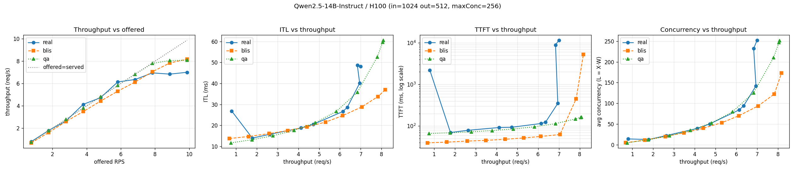

# Latency–Throughput Curves: Real vLLM vs Simulators
### Qwen2.5-14B-Instruct on NVIDIA H100-80GB

**Date:** 2026-06-24
**Workload:** Poisson arrivals; mean input 1024 tokens, mean output 512 tokens; running-batch cap 256.

---

## 1. Summary

We measured the latency–throughput curve of a **real** Qwen2.5-14B-Instruct vLLM
server on an H100 and reproduced it with two **simulators** that implement the same
`POST /solve` contract: the **BLIS** discrete-event simulator (`trained-physics`
backend) and the **queue-analysis** analytical model. All three were driven by the
same sweep tool (`scripts/benchmark_curve.py`) over an identical arrival-rate grid.

Headline results:

- The real server tops out at **~7 req/s** for this workload (knee at ~7.6 req/s).
- **Throughput** agrees across all three to within ~10–15% up to the knee.
- **Inter-token latency (ITL)** agrees well for both simulators in the normal range.
- **TTFT** is matched closely by queue-analysis but **under-modeled by BLIS**.
- A **bug in the BLIS analytical saturation pre-check** initially made BLIS unusable
  for this workload (it declared saturation at ~0.22 req/s). We fixed it; that fix is
  the subject of a separate PR.



*Four panels, left to right: throughput vs offered load, ITL vs throughput, TTFT vs throughput (log y), and avg concurrency vs throughput (Little's law `L = X·W`, using the served throughput). Real = solid, BLIS = dashed, queue-analysis = dotted.*

---

## 2. Objective

Validate that the simulator backends behind `server-sim` reproduce a real vLLM
server's latency–throughput behaviour for a concrete (model, accelerator, workload),
and quantify where they agree and diverge — an A/B of *simulated* vs *measured*
curves.

---

## 3. Setup

### 3.1 Hardware & platform
- OpenShift cluster, `NVIDIA-H100-80GB-HBM3` nodes.
- Namespace `inferno-workload`. The full inferno control loop was **not** deployed —
  the benchmark driver must be the sole `/solve` caller.

### 3.2 Real server
`Qwen/Qwen2.5-14B-Instruct`, vLLM `v0.21.0`, bf16, `--max-model-len 4096`,
`--max-num-seqs 256`, `--gpu-memory-utilization 0.90`, served as `qwen`.
At startup vLLM reported the KV capacity we later used to calibrate the simulator:

```
Available KV cache memory: 41.43 GiB
GPU KV cache size: 226,240 tokens
Maximum concurrency for 4,096 tokens per request: 55.23x
```

### 3.3 The three evaluators

| Track | Evaluator | GPU? | model / accel key | Parameters |
|-------|-----------|------|-------------------|------------|
| **real** | `continuous-vllm-server` | yes | `qwen_2_5_14b` / `H100` | drives the live vLLM; trailing-window metrics |
| **blis** | `blis-evaluator` (`trained-physics`) | no | `Qwen/Qwen2.5-14B-Instruct` / `H100` | KV/batch/HW config + generic trained coeffs |
| **qa** | `queue-analysis-evaluator` | no | `qwen_2_5_14b` / `H100` | α=10.645, β=0.0418, γ=5.77e-5 |

The queue-analysis α/β/γ are the run16-converged values previously fit to this same
real qwen server, so that curve is expected to track real most closely.

---

## 4. Methodology

### 4.1 Sweep protocol
`scripts/benchmark_curve.py` POSTs `ProblemData` setpoints and reads back
`AnalysisData`. For the **real** run (a loss system with a trailing window) it ramps
to find the knee, then sweeps 10 points, settling ≥ one 90 s window per point. For
the two **simulators** (one-shot, deterministic) the window machinery is disabled and
the same 10-point arrival-rate grid is swept directly. Derived quantities:
`dropFraction = 1 − throughput/offered`, `concurrency = throughput × respTime`
(Little's law).

### 4.2 Calibrating the BLIS config
`totalKVBlocks` was read from the live server, not estimated:
`226,240 tokens / 16 tokens-per-block = 14,140 blocks` (an a-priori estimate of 6144
was ~2× low). `maxModelLen` was set to 4096 to match the server.

### 4.3 Fixing the BLIS saturation pre-check
BLIS runs an analytical guard *before* the DES to skip obviously-overloaded configs.
For this workload it vetoed at **~0.22 req/s** — returning `saturation: "bandwidth"`,
throughput 0 — roughly 30× below the real ceiling. Two bounds were too conservative:

- **Bandwidth:** compared aggregate demand `RPS·L_out` against the *batch-size-1*
  weight-streaming rate `BW/weightBytes ≈ 113 tok/s`, ignoring that a real engine
  decodes a whole batch per weight stream.
- **KV:** used a worst-case `maxConcurrency·meanTokens` occupancy (256·1536 > KV
  capacity), saturating at *any* arrival rate even though vLLM dynamically caps the
  running batch and queues the rest.

We confirmed the DES itself was healthy (a benign small config simulated correctly) —
only the pre-check vetoed. The fix makes the bound **batch-aware**:

```
avgContext = L_in + L_out/2
B          = min(maxRunningReqs, TotalKVSlots / avgContext)     # KV limits the batch
t_step     = (weightBytes + B·avgContext·kvBytesPerToken) / (BW·TP)
decodeTPS  = B / t_step
saturated if RPS·L_out > decodeTPS · 0.98 ;  maxRPS = decodeTPS / L_out
```

with a degenerate `kv_capacity` result only when a single average request's context
cannot fit (`B_kv < 1`). For this workload the patched bound yields maxRPS ≈ 15.6 —
about 2× *optimistic* vs the real ~7 knee, but it no longer falsely vetoes the
operating range, so the DES runs through it (and flags overload itself post-sim).

---

## 5. Results

| RPS | Tput real | Tput blis | Tput qa | ITL real | ITL blis | ITL qa | TTFT real | TTFT blis | TTFT qa |
|-----|-----------|-----------|---------|----------|----------|--------|-----------|-----------|---------|
| 0.76 | 0.80 | 0.69 | 0.76 | 27 | 14 | 12 | 2206* | 39 | 66 |
| 1.77 | 1.79 | 1.60 | 1.77 | 14 | 15 | 13 | 70 | 41 | 69 |
| 2.78 | 2.63 | 2.59 | 2.78 | 16 | 16 | 15 | 79 | 43 | 73 |
| 3.80 | 4.13 | 3.48 | 3.80 | 19 | 17 | 18 | 92 | 45 | 78 |
| 4.81 | 4.73 | 4.42 | 4.81 | 21 | 19 | 21 | 93 | 48 | 85 |
| 5.82 | 6.14 | 5.31 | 5.82 | 27 | 22 | 27 | 115 | 52 | 96 |
| 6.83 | 6.36 | 6.13 | 6.83 | 29 | 25 | 36 | 123 | 56 | 114 |
| 7.85 | 6.95 | 7.05 | 7.79 | 40 | 29 | 53 | 350 | 62 | 148 |
| 8.86 | 6.84 | 7.83 | 8.05 | 49 | 34 | 60 | 8954 | 453 | 162 |
| 9.87 | 7.00 | 8.18 | 8.08 | 48 | 37 | 61 | 11591 | 5279 | 164 |

Tput = req/s, ITL = ms, TTFT = ms. *The real 0.76 point pays the one-time warmup
(cold cache + first window); treat its TTFT/RespTime as a warmup artifact.*

Per-track raw curves: [`results/curve_*`](results/) (real),
[`results/blis-sim/`](results/blis-sim/), [`results/qa-sim/`](results/qa-sim/).

---

## 6. Discussion

**Throughput.** All three trace the same line until the knee, then bend. Real
plateaus at ~7 req/s; queue-analysis tracks it almost exactly and plateaus at ~8
(its analytic maxRPS = 8.1); BLIS tracks within ~10–15% and saturates near 8. The
knees agree to within ~1 req/s.

**ITL.** Both simulators match real well in the normal range (e.g. at ~5.8 req/s:
real 27, qa 27, blis 22 ms). Near and past the knee, queue-analysis slightly
over-predicts and BLIS slightly under-predicts ITL.

**TTFT.** The clearest divergence. Queue-analysis stays close to real in the normal
range (66–164 vs 70–350 ms); BLIS under-models it badly (39–62 ms). The reason is
calibration: queue-analysis's α/β/γ were fit to this server, whereas the BLIS run
used **generic** queueing coefficients. Neither reproduces the magnitude of the real
TTFT blow-up past saturation (real → 8–11 s) because both are stable-state models;
the real loss system's queue dynamics dominate there.

**Concurrency.** Computed by Little's law `L = X·W` with the **served** throughput
`X` (not the offered rate — in a loss system they diverge past the knee). Real and
queue-analysis both climb toward the 256 running-batch cap near saturation (max ~252),
while BLIS tops out at ~173. This is the same gap seen in latency, viewed through
Little's law: because BLIS under-models response time `W`, its inferred in-flight
count `L` is correspondingly lower at the same throughput. Concurrency approaching the
cap is the in-flight-count view of the throughput plateau.

**Interpretation.** The headline is not "analytic beats DES" — it is **"a model
calibrated to the target tracks the target best."** Queue-analysis won on TTFT purely
because its parameters were fit to this exact server. BLIS, given only generic
coefficients and a KV calibration, still reproduced throughput and ITL well; matching
its TTFT would require fitting its queueing coefficients (`alphaCoeffs`) to the
server, exactly as was done for queue-analysis.

---

## 7. Conclusions

1. Both simulators reproduce the real throughput and ITL curves for this workload to
   useful accuracy; they bracket the real knee (~7–8 req/s).
2. TTFT fidelity is governed by calibration. The calibrated analytical model tracks
   real TTFT; the generic-coefficient DES does not.
3. The BLIS analytical saturation pre-check contained a real over-conservatism bug
   (batch-size-1 bandwidth bound + worst-case KV occupancy) that vetoed normal
   batched workloads. The fix is batch-aware and is proposed as a standalone PR.
4. Calibrating `totalKVBlocks` from the live server (not estimating it) matters: the
   estimate was ~2× off and would have skewed the KV-capacity behaviour.

### Next steps
- Land the BLIS pre-check fix (separate PR + issue).
- Fit BLIS `alphaCoeffs` to this server and re-run to test the TTFT hypothesis.
- Repeat the sweep at other token mixes / concurrency caps to map more of the surface.

---

## 8. Reproduction & artifacts

Step-by-step deploy and run commands are in [`README.md`](README.md). Artifacts in
this directory:

- `manifests/` — the exact manifests deployed (vLLM server, managed wrapper, eval
  ConfigMap, RBAC) and the queue-analysis α/β/γ (`model-data-qa.json`).
- `compare_curves.py` — builds the overlay table + figure from the three CSVs.
- `results/` — per-track CSV/MD/PNG, the vLLM startup calibration, and the 3-way
  `comparison.{md,png}`.

The BLIS config entry (`blis-evaluator/blis-config.json`) and the `checkSaturation`
patch live in the repo, not in this directory.
